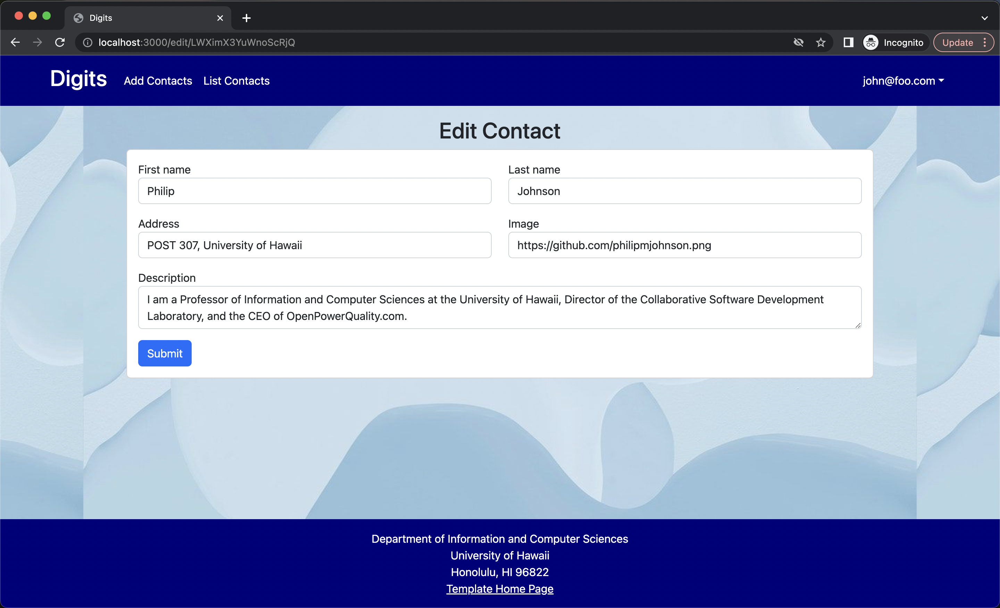

# Digits
## Installation
Installing this application is pretty simple:
- Click on the green 'Code' button on the top right above the list of files. Then, select your method of choice for cloning the repository.
- Once you have done so, open up the Command Line or Terminal and cd into the app/ directory of your cloned respository.
- Within the app/ directory, run `meteor npm install`, then `meteor npm run start`. This will start running the application.
- Follow the instructions on your Command Line/Terminal to go to `http://localhost:3000/` to find your new application!

## Features
Digits is a basic application for storing contacts for a user, as well as keeping notes on each of those contacts. A user will first need to login or register to access these features.

 

After logging in, a user will have access to their contacts from the navigation bar at the top.

This page displays all the contacts that the user has created. The user can also add notes to a contact for information that did not exist before in the contact, like a birthday. However, if the user wishes to change the information in the contact, they can edit the contact by clicking on `Edit` at the bottom of the contact card.

If the user wishes to add a contact, an option for the action can be seen on the navigation bar as well. Clicking on it will yield a page to create new contacts.

This is only the basic user interface. If one logs in as an admin, they also have special access to other information. An admin can see the contacts of all users through a new page on the navigation bar specific to admin users.

That's it! Feel free to play around in this application to your liking.
